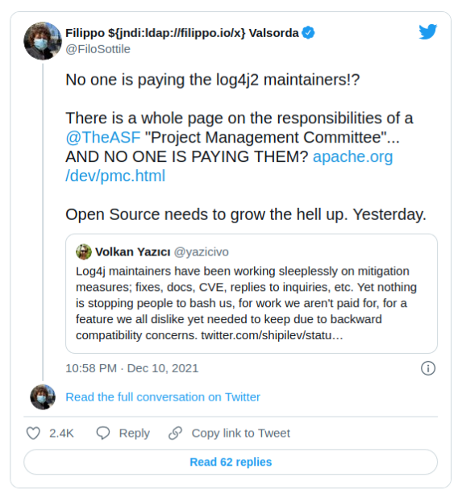

<h1 align="center">OpenFare</h1>

<p align="center">⚡️ Decentralized payment plans for source available software. ⚡️</p>

<p align="center">
  <a href="https://matrix.to/#/#openfare:matrix.org"></a>
</p>

OpenFare is a system for compensating source available software maintainers. The system is composed of the following components:

* the OpenFare license
* payment plans defined in code
* a tool for managing payment obligations across OpenFare licensed software packages
* seamless micro-payments using the [Bitcoin Lightning Network](https://lightning.readthedocs.io/lightning-keysend.7.html), [Stripe](stripe.com), etc.

Non-commercial use of software under an OpenFare license is free. For commercial use, the license specifies payment plans which are committed in code.

Payments sent to software maintainers using Lightning arrive passively. OpenFare is designed for simple setup and payment obligation management across thousands of software dependencies.

OpenFare is not a faultless solution. It hopes to present a saner trajectory. Join the [chat room](https://matrix.to/#/#openfare:matrix.org) to discuss further.

## Motivation

<p align="center">
    <a align="center" href="https://twitter.com/FiloSottile/status/1469441477642178561">
    
    </a>
</p>

The open source software ecosystem has a maintenance problem. Thousands of critical software dependencies are maintained on the good will of casual volunteers. This fragile state means that critical software is abandoned or maintained with a passing interest. A security and stability nightmare.

Sponsorship and donation schemes have largely failed. They are not game theoretically viable strategies for addressing the problem. The solution is micro-payment compensation at scale.

## OPENFARE.json

The `OPENFARE.json` file defines commercial payment plans for a software package. Within a project, it is always located next to the project `LICENSE` file (usually in the top level directory).

The following example describes two payment plans. One plan is applicable for organizations with more than 100 developers, and the other for those with less. In the latter case, two payments must be made every 30 days using the Lightning Network, one to `Contributor A` and the other to `Contributor B`.

```json
{
    "plans": [
        {
            "conditions": [
                {
                    "developers_count": ">=100"
                }
            ],
            "payments": [
                {
                    "method": {
                        "name": "stripe",
                        "public_key": "pk_live_thn8fkM3p7jV25rj5HwkRVJq",
                        "url": "https://api.stripe.com"
                    },
                    "recipient": {
                        "name": "Company LLC.",
                        "address": "12, Yellow Brick Road, UK"
                    },
                    "price": "50 USD"
                }
            ],
            "frequency": "30 days"
        },
        {
            "conditions": [
                {
                    "developers_count": "<100"
                }
            ],
            "payments": [
                {
                    "method": {
                        "name": "btc_lightning_keysend",
                        "address": "02788242941915ed5a101511b8dfeb6db81e0fcd7546f6a55ef4dedf590a7d7ff4"
                    },
                    "recipient": {
                        "name": "Contributor A",
                        "address": null
                    },
                    "price": "0.0002 BTC"
                },
                {
                    "method": {
                        "name": "btc_lightning_keysend",
                        "address": "03446242941915ed5a101511b8dfeb6db81e0fcd7546f6a55ef4dedf590a7p8kk2"
                    },
                    "recipient": {
                        "name": "Contributor B",
                        "address": null
                    },
                    "price": "0.0001 BTC"
                }
            ],
            "frequency": "30 days"
        }
    ]
}
```

## Concerns

> Can't project maintainers just setup a website with payment plans and customer accounts?

OpenFare defines payment plans in code whilst avoiding the unnecessary overhead of customer accounts or a website. A commercial entity can make use of thousands of software packages. OpenFare standardizes payment plan information across software packages such that it can be managed programmatically at large scales.

> Why use the Bitcoin Lightning Network for payments?

The Lightning Network facilitates permissionless micro-payments to anyone with a computer and an internet connection. Payments sent to software maintainers using Lightning arrive passively.

> What if commercial users neglect to pay? Who will stand up for the project maintainers?

Software developers who work for commercial entities **want** to pay for well maintained source available software. They understand that the situation is precarious because open source developers largely go unpaid. They also can't easily justify donations or charitable sponsorship when they work at for-profit companies.

> What obligation do maintainers have to the project after being payed?

They have no obligation. A maintainer could receive payment and not work further on the project. But the popularity of the project and the associated payment plans would be public information. Competing projects where maintainers are willing to work for the same payments would win out.

> What happens if a project uses several versions of the same software package?

For a given software package, only the payment plans given in the latest in use version is considered.
